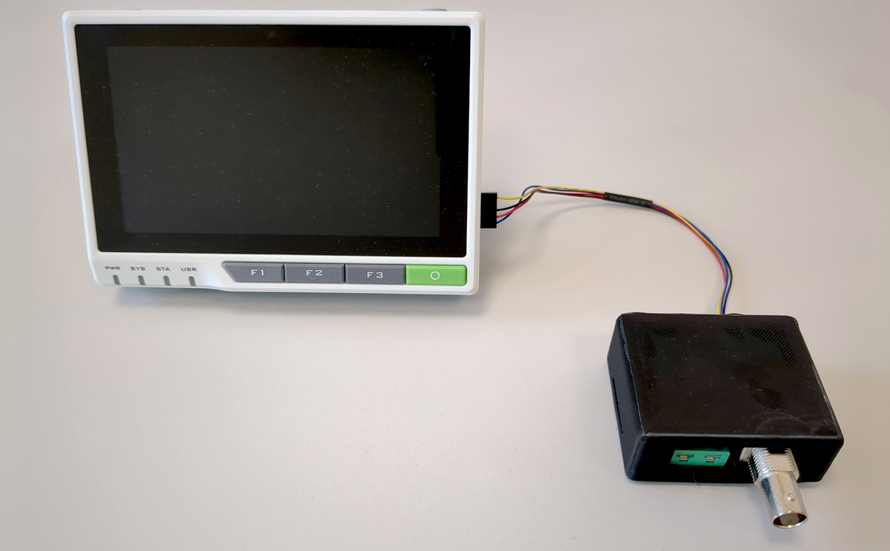

# Introduction

Source code and PCB design files for an impedance and temperature measurement
instrument. 

# Hardware



The instrument features a BNC socket for connecting the device under test (DUT).
A standard miniature IEC socket allows the connection of a thermocouple.

The board has been designed in KiCad. You can use it to generate your own
Gerbers.

Here's a partial BOM:

* Impedance IC: AD5933
* Thermocouple IC: MCP9600
* Mux: ADG729

The control terminal is a [Seeed Studio
reTerminal](https://wiki.seeedstudio.com/reTerminal/) which is basically a
Raspberry Pi CM4 with a touchscreen and some other peripherals.

# Software

The software is built as a stage for
[pi-gen](https://github.com/RPi-Distro/pi-gen). Just drop it in and include it.
There's also a stage for the device tree and display driver of the reTerminal
device. Both of these are unfortunately not upstreamed.

After building, the result will be an image that can be directly written to the
device. It will boot straight into the UI. The Qt application runs on a DRM
framebuffer without a display server (EGLFS). The image has been tested with the
64 bit version of Bullseye.

The code does contain some out-of-tree modifications to the AD5933 IIO kernel
driver. It has been extended with variable clock rate support (for low
excitation frequencies). In the default implementation the clock is sourced from
the Raspberry Pi GPCLK peripheral.

Additionally, there's a tiny patch to libiio (included as a binary package in
this repo):
https://lore.kernel.org/all/1204b19a92343a9e3a6ec5df3cef94f6777e08c4.camel@jku.at/

# Manual

There's a manual that can be built with pandoc. Set up a LaTeX environment and
run the following to build a PDF:
```sh
make pdf
```
You can also generate a nice printable booklet using:
```sh
make booklet
```
This requires the `pdfbook2` script which is part of TeX Live and shipped in the
"texlive-extra-utils" package on Debian.